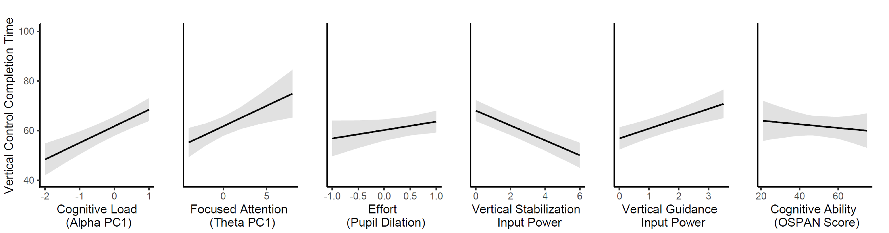

# Drone Piloting Skill Acquisition Project
## Introduction
This repository contains the UX research conducted on the training needs and skill acquisition of drone pilots. The research aims to improve drone pilot training by utilizing biometric and behavioral measures to assess performance and cognitive load.

## Research Questions and Hypotheses
| Research Question | Hypotheses |
| --- | --- |
| **Q1:** Are biometric and behavioral measures associated with drone piloting skill acquisition task-specific? | The biometric and behavioral factors significantly affecting completion times for vertical control tasks and transfer & land tasks are different. |
| **Q2:** Does cognitive ability moderate the effect of biometric measures on performance? | There is a non-zero interaction coefficient between biometric measures and cognitive ability scores on completion times. |
| **Q3:** Does the amount of control input behavior impact performance? | One or more input behaviors have a coefficient that is not zero in the linear equation with completion time as the response variable. |
| **Q4:** How does increased payload (weight) affect task performance? | There is a significant difference in the mean completion time before and after the payload increase. |

## Methodology

A series of controlled experiments using drone flight simulations in a laboratory setting were conducted. Brain electrical activity, eye movements, and control behavior were recorded during the training sessions for two different drone tasks. The following biometric and behavioral measures were assessed:

### Experimental Data Collection and Measures
- **EEG Band Powers**: Alpha, Beta, Theta power
- **Pupil Dilation**: Cognitive load and effort
- **Control Input Behavior**: Joystick movement frequencies
- **Working Memory Capacity**: OSPAN Score

### Participants and Study Design
Fifteen graduate and undergraduate engineering students participated in the experiments, which included training on two piloting tasks: vertical control and transfer & land. The experiments were conducted using the Aerosim RC pilot training simulator.

### Experimental Procedure

### Biometric and Behavioral Measures and Associated Psychological Features
| Biometric and Behavioral Metrics | Psychological Features |
| --- | --- |
| Alpha PC1 | Cognitive load |
| Theta PC1 | Focused attention/Enhanced attention control |
| Beta PC1 | Vigilance/Arousal/Alertness |
| Pupil Dilation | Effort |
| OSPAN Score | Working memory capacity |
| Throttle power 0-1 Hz | Vertical guidance input size |
| Throttle power 2-3 Hz | Vertical stabilization input size |
| Aileron power 0-1 Hz | Sideward guidance input size |
| Aileron power at 2-3 Hz | Sideward stabilization input size |
| Elevator power at 0-1 Hz | Forward/backward guidance input size |
| Elevator power at 2-3 Hz | Forward/backward stabilization input size |
| Rudder power at 0-1 Hz | Turn guidance input size |
| Rudder power at 2-3 Hz | Turn stabilization input size |

## Results and Discussion

### Q1: Are biometric and behavioral measures associated with drone piloting skill acquisition task-specific?
- **Cognitive Load**: Higher cognitive loads were associated with longer completion times for both tasks.
- **Focused Attention**: Less focused attention was needed for the vertical control task as skill improved.
- **Vigilance**: Increased vigilance improved performance for standard drone tasks but had mixed effects for more complex tasks.

### Q2: Does cognitive ability moderate the effect of biometric measures on performance?
- **Vertical Control Task**: Effort was moderated by cognitive ability, with higher cognitive ability associated with better performance under greater effort.
- **Transfer & Land Task**: No significant moderation effect was found.

### Q3: Does the amount of control input behavior impact performance?
- **Vertical Control Task**: Greater stabilization input was associated with better performance.
- **Transfer & Land Task**: Larger guidance and stabilization inputs led to better performance, with some task-dependent effects.

### Q4: How does increased payload (weight) affect task performance?
- **Performance Improvement**: Continued practice improved performance for both tasks and difficulty levels, with differential impacts observed for increased task difficulty.

### Visualizations
#### Vertical Control Completion Time Main Effects

#### Vertical Control Completion Time Interaction

#### Transfer & Land Task Completion Time Main Effects

#### Transfer & Land Task Completion Time Interactions

## Conclusions

The study identified biometric and behavioral indicators for drone piloting skill learning across tasks and difficulty levels. Recommendations for training programs and usability tests are provided.

### Key Findings
- **Cognitive load, focused attention, and vigilance are key biometric measures associated with performance.**
    - These measures can be use to develop Artificial Intelligence-based training paradigms that incorporate these behavioral and biometric factors as inputs to create engaging and tailored learning experiences. 

- **Cognitive ability moderates the effect of biometric measures on performance.**
    - This highlights the value of quantifying individual differences, such as cognitive ability.
- **Control input behavior impacts performance, with task-specific effects.**
    - There is support for employing controller input behavior in user-centered design for performance. Data from controller input provides continuous, inexpensive, non-intrusive, and robust information about pilot performance. The design of new features, advanced systems, and safety overrides can benefit from understanding and considering pilots' control responses. For example, during a handoff of an assistive system, instability-induced control behaviors may suggest alternative designs. 

- **Increased task difficulty affects performance differentially across tasks.**
    - The amount of relearning required due to an increase in task difficulty varied by task type. Heuristic evaluations of drone designs or usability tests on a single mission may not provide sufficient information for optimal design. That is, design usability should be evaluated across a variety of drone missions.

    - A training regimen might follow significant design changes, focusing on relearning or retraining specific tasks. However, this may require the identification of specific drone flight requirements and technologies. Drone missions might be decomposed into specific sub-tasks, with each evaluated for usability when designing a drone/pilot system interface.

### Future Work
Further research in practical settings is necessary to validate these findings and develop AI-based training paradigms that incorporate biometric and behavioral factors for tailored learning experiences.

