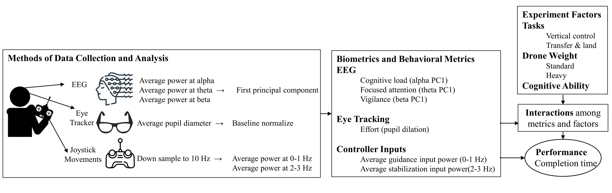
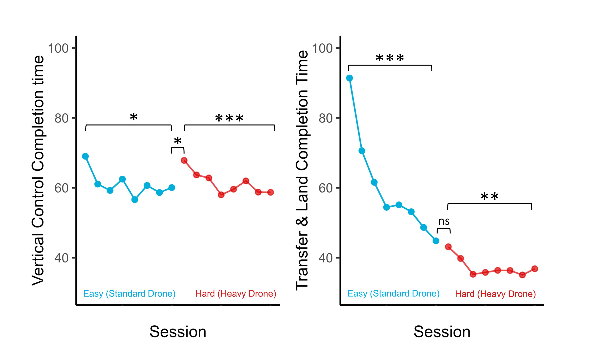

# Drone Piloting Skill Acquisition Project
## Introduction
This repository contains the UX research conducted on the training needs of drone pilots as well as usability testing of drone designs. The research aims to improve drone pilot training and drone designs utilizing biometric and behavioral measures to assess performance and cognitive load.

## Research Questions

 **Q1:** How does increased payload (weight) affect task performance? 

 **Q2:** Does the amount of control input behavior impact performance?

 **Q3:** Are biometric and behavioral measures associated with drone piloting skill acquisition task-specific?
 
 **Q4:** Does cognitive ability moderate the effect of biometric measures on performance?
 

 
 
## Methodology

A series of controlled experiments using drone flight simulations in a laboratory setting were conducted.Fifteen graduate and undergraduate engineering students participated in the experiments. Participants' brain electrical activity, eye movements, and control behavior were recorded during the training sessions for two different drone tasks: vertical control and transfer & land. 

### Experimental Procedure
Participants began with the less complex, lighter – standard drone. After finishing 8 repeated trials with the standard drone successfully, the piloting task difficulty was increased via the drone weight by 10% and subsequently repeated 8 times. 

### Experimental Data Collection and Measures
- **EEG Band Powers**: Alpha, Beta, Theta power
- **Pupil Dilation**: Cognitive load and effort
- **Control Input Behavior**: Joystick movement frequencies
- **Working Memory Capacity**: OSPAN Score

## Analysis

- To find the important behavioral and biometric measures associated with learning as well as the moderating effect of cognitive ability, a mixed model regression was used with participants modeled as random effects, behavioral and affective measures as independent variables, and performance as the dependent variable. 

- To examine how practice affects task completion times and how increasing difficulty levels affect performance, pairwise paired t-tests were performed.

## Results and visulaizatons
#### Task Completion Times for Vertical Control and Transfer & Land Tasks

#### Vertical Control Completion Time Main Effects

#### Vertical Control Completion Time Interaction

#### Transfer & Land Task Completion Time Main Effects

#### Transfer & Land Task Completion Time Interactions

## Findings

### Q1: How does increased payload (weight) affect task performance?
- **The amount of relearning required due to an increase in task difficulty varied by task type.**
    - Heuristic evaluations of drone designs or usability tests on a single mission may not provide sufficient information for optimal design. Design usability should be evaluated across a variety of drone missions.
    - A training regimen might follow significant design changes, focusing on relearning or retraining specific tasks.
    - Drone missions might be decomposed into specific sub-tasks, with each evaluated for usability when designing a drone/pilot system interface.

### Q2: Does the amount of control input behavior impact performance?
- **Control input behavior impacts performance, with task-specific effects.**
    - There is support for employing controller input behavior in user-centered design for performance. Data from controller input provides continuous, inexpensive, non-intrusive, and robust information about pilot performance. The design of new features, advanced systems, and safety overrides can benefit from understanding and considering pilots' control responses. For example, during a handoff of an assistive system, instability-induced control behaviors may suggest alternative designs.

### Q3: Are biometric and behavioral measures associated with drone piloting skill acquisition task-specific?
- **Cognitive load, focused attention, and vigilance are key biometric measures associated with performance.**
    - These behavioral and biometric factors can be incorporated as inputs to develop Artificial Intelligence-based training paradigms for engaging and tailored learning experiences.

### Q4: Does cognitive ability moderate the effect of biometric measures on performance?
- **Cognitive ability moderates the effect of biometric measures on performance.**
    - This highlights the value of quantifying individual differences, such as cognitive ability, for training and usability testing.

## Conclusions

This study provided recommendations and methods for testing drone operation usability and learnability, finding that behavioral and biometric metrics for assessing usability and learnability testing should be selected based on factors including skill level, individual differences in cognitive ability, task type, and task difficulty.

