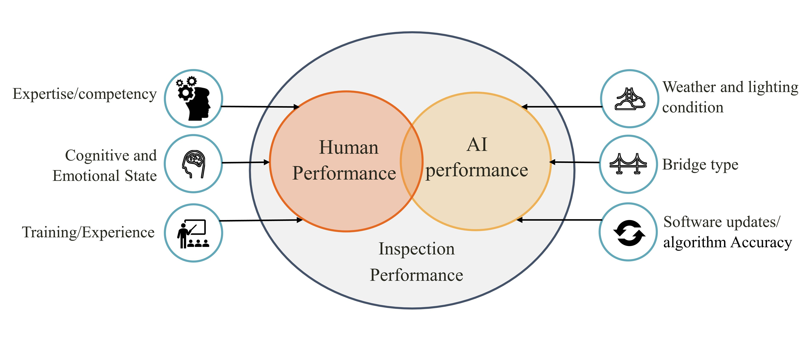
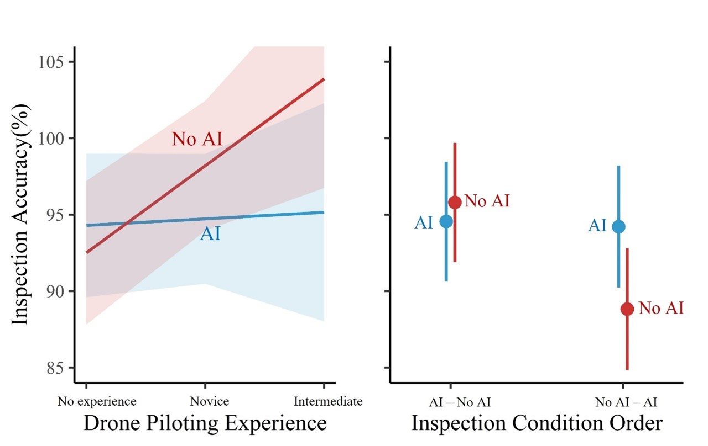

# UX Research Portfolio - AI-Assisted Bridge Inspections

## Project Overview
This project explores the effectiveness of drone_enabled AI-assisted bridge inspections compared to "no AI" inspections. The focus is on understanding how AI assistance impacts overall inspection accuracy, how drone piloting skills influence inspection performance, and which behaviors and cognitive states affect the probability of detecting or missing bridge damage.

## Research Questions
1. **How does AI assistance affect overall inspection accuracy?**
2. **Do drone piloting skills affect inspection performance?**
3. **What behaviors and cognitive states affect the probability of the operator missing or successfully detecting bridge damage?**

## Methodology
The research involved a controlled laboratory experiment simulating drone-based bridge inspections under two conditions: one without AI assistance (no-AI) and another with imperfect AI assistance (AI). Key elements included:

- **Participants**: 45 engineering students (31 male, 14 female) from the University of Iowa, aged 23.53 years on average.
- **Conditions**: 
  - **No-AI Condition**: Participants inspected the bridge for cracks without AI assistance.
  - **AI Condition**: An 80% accurate AI assisted participants by highlighting suspect cracks with green boxes. Participants confirmed or refuted these indications.
- **Data Collection**: Continuous EEG and eye tracking to measure brain activity and eye movements, joystick positions to capture control behavior.
- **Survey**: Participants completed a survey regarding their drone piloting experience and video gaming experience. 
- **Experimental Setup**: Participants flew a drone along a simulated bridge, identifying and marking cracks, and reporting false alarms.

## Experimental Measures
- **EEG Band Powers**: Used to estimate cognitive and emotional states.
- **Eye Tracking**: Measures like fixation count, saccade count, and gaze velocity were used to assess search behavior.
- **Controller Inputs**: Right/left joystick positions were analyzed to compute stabilization and guidance input metrics.

## Analysis
Two main analyses were performed:

1. **Mixed Linear Regression**: To assess the effect of AI assistance and drone experience on inspection accuracy.
2. **Mixed Logistic Regression**: To determine the impact of biometric and behavioral metrics on the probability of missing cracks in each condition.

## Key Findings
### Q1 & Q2: The Effect of AI-assistance and Drone Piloting Experience on Inspection Accuracy

- **Drone Piloting Experience**: More experience in piloting drones significantly improves inspection accuracy in the no-AI condition, suggesting that mastering piloting skills enhances overall task performance.
- **AI Condition**: In the AI-assisted condition, performance was not significantly affected by drone piloting expertise. The AI's high accuracy (80%) helped compensate for human errors, indicating that the AI's capabilities played a crucial role in inspection accuracy.
- **Training Implications**: Effective bridge inspection training programs should include thorough and overtraining in piloting to ensure safety and quality, especially when AI assistance is involved.

- **Initial AI Assistance**: Participants who started with the no-AI condition showed lower performance, while those who began with AI assistance maintained their performance even when transitioning to the no-AI condition, , supporting the integration of AI in bridge inspector training programs..
- **Training Implications**: Integrating AI assistance into inspection training can positively impact the training process by automating some tasks and providing initial learning support. This allows learners to apply skills acquired from AI decision-making systems to enhance their performance in non-AI conditions.
### Q3: Biometric and Behavioral Correlates of P(Miss)

- **Intense Cognitive Processing**: Increased EEG gamma power was linked to higher likelihood of detection failures, both with and without AI assistance, highlighting the need to manage cognitive load in assistive systems and training protocols.
- **Visual Scanning Strategies**: Effective visual scanning strategies, such as avoiding chaotic gaze patterns, are crucial for enhancing inspection accuracy.
- **Early AI Exposure**: Early exposure to AI assistance helps maintain high performance levels among inspectors

## Conclusion
This study highlights the importance of integrating AI assistance in bridge inspection training programs and suggests that understanding cognitive load and visual scanning strategies can enhance inspection accuracy. The findings support the development of AI-based training programs and cognitive monitoring systems to optimize inspector performance and safety.

